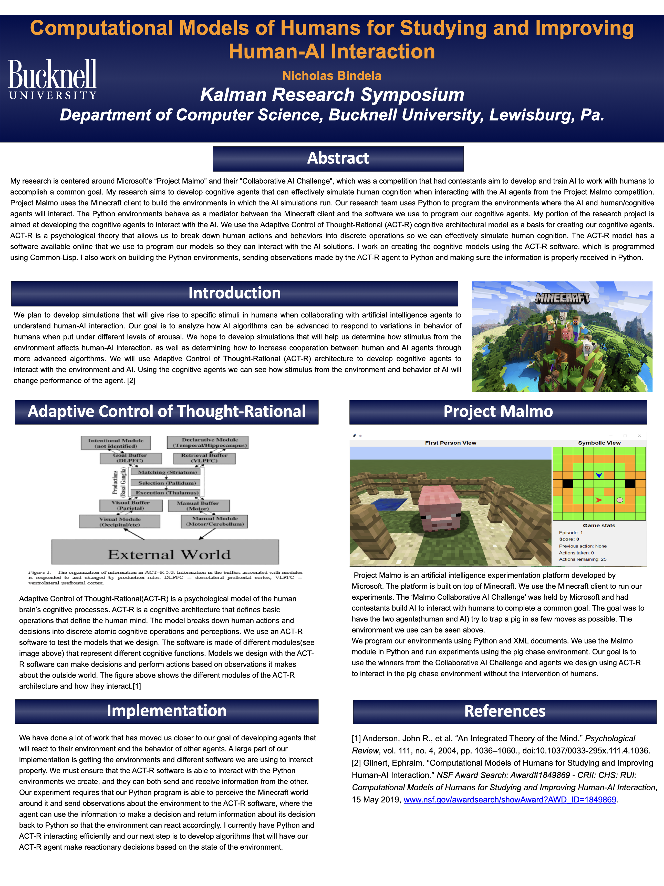

# Human-Computational-Models

## Overview
This research focused on developing human-like artificial agents to understand and simulate human cognitive processes. Below is a visual representation of the project's poster:

*Figure: Poster summarizing the research done.*

Please Download the pdf version of the poster for a high quality view.
